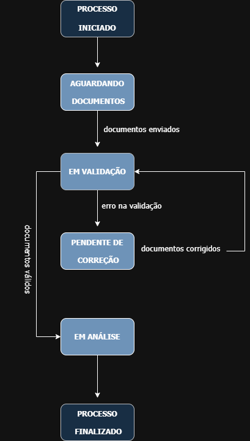
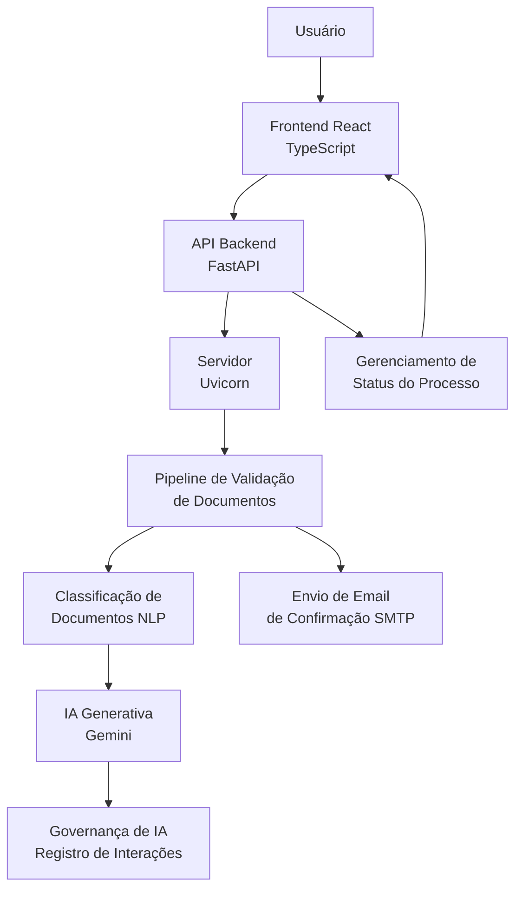

# FIAP - Faculdade de Informática e Administração Paulista

<p align="center">
<a href="https://www.fiap.com.br/"></a>
</p>

<br>

# YOUVISA – Plataforma Inteligente de Atendimento Multicanal (Sprint3)
## Beginner Coders
## 👨‍🎓 Integrantes:
- <a href="https://www.linkedin.com/in/luana-porto-pereira-gomes/">Luana Porto Pereira Gomes</a>
- <a href="https://www.linkedin.com/in/luma-x">Luma Oliveira</a>
- <a href="https://www.linkedin.com/in/priscilla-oliveira-023007333/">Priscilla Oliveira </a>
- <a href="https://www.linkedin.com/in/paulobernardesqs?utm_source=share&utm_campaign=share_via&utm_content=profile&utm_medium=ios_app">Paulo Bernardes</a>

## 👩‍🏫 Professores:
### Tutor(a)
- <a href="https://www.linkedin.com/in/leonardoorabona/">Leonardo Ruiz</a>
### Coordenador(a)
- <a href="https://www.linkedin.com/in/profandregodoi/">André Godoi</a>

---

# 📘 Introdução

Este repositório apresenta a evolução do projeto YOUVISA desenvolvido durante o **Enterprise Challenge da FIAP**, na **Sprint 3**.

O objetivo desta etapa foi **evoluir o protótipo da Sprint 2**, adicionando capacidades reais de **Inteligência Artificial Generativa**, além de implementar mecanismos de **governança de IA** e melhorias no pipeline do chatbot.

Nesta versão, o sistema passa a utilizar **modelo real de IA (Google Gemini)** para geração de respostas contextualizadas, mantendo o pipeline inteligente de validação documental e o chatbot integrado ao estado atual do processo do usuário.

---

# 🎯 Objetivo da Sprint 3

A Sprint 3 teve como objetivo evoluir o sistema YOUVISA com:

- Integração com **IA generativa real (Google Gemini)**
- Implementação de **governança de IA**
- Registro de interações da IA para auditoria
- Melhoria do pipeline de resposta do chatbot
- Tratamento de erros com fallback inteligente
- Modelagem do **diagrama de estados do processo**
- Respostas mais naturais e contextualizadas

---

# 🧠 Inteligência Artificial Generativa

Diferente da Sprint 2, que utilizava **IA simulada**, nesta etapa o sistema passou a utilizar um **modelo real de linguagem generativa**.

O backend integra o serviço: Google Gemini API

Esse modelo é responsável por gerar respostas contextualizadas para o chatbot YOUVISA.

O prompt enviado ao modelo contém:

- regras de comportamento
- contexto do processo do usuário
- pergunta enviada pelo usuário

Isso permite que a IA gere respostas mais naturais e adaptadas ao estado atual do processo.

---

# 🛡 Governança de IA

Para garantir boas práticas no uso da IA, foi implementado um módulo de **governança de IA**.

Arquivo responsável: backend/src/nlp/ai_governance.py

Este módulo registra as interações da IA, incluindo:

- pergunta do usuário
- resposta gerada pelo modelo
- rastreabilidade das respostas

Esse registro permite:

- auditoria de comportamento da IA
- análise futura das respostas
- controle de qualidade das interações

Essa prática segue princípios de **AI Governance utilizados em sistemas corporativos**.

---

# 🔄 Pipeline de Resposta do Chatbot

O fluxo de resposta do chatbot agora segue o seguinte pipeline:

1️⃣ Usuário envia pergunta  

2️⃣ Sistema coleta contexto do processo  

3️⃣ Prompt estruturado é enviado ao modelo Gemini  

4️⃣ Modelo gera resposta baseada no contexto  

5️⃣ Resposta é registrada no módulo de governança  

6️⃣ Chatbot retorna resposta ao usuário  

---

# ⚠ Tratamento de Erros da IA

Foi implementado um mecanismo de **fallback inteligente**.

Caso ocorra falha na geração da resposta pela IA:

- o sistema captura o erro
- identifica o status atual do processo
- responde ao usuário com base no status real

Exemplo de fallback:

> "Desculpe, tive um problema técnico ao gerar uma resposta personalizada agora.  
> Mas consultando o sistema, vi que seu processo está com o status: **em análise**."

Isso garante que o sistema continue funcional mesmo em caso de falha do modelo.

---

# 📊 Diagrama de Estados do Processo

Foi implementado um **diagrama de estados** que representa o fluxo completo do processo do usuário dentro da plataforma YOUVISA.

Esse fluxo permite acompanhar o ciclo de vida do envio e validação de documentos dentro do sistema.

## Estados do Processo

- Processo iniciado
- Aguardando documentos
- Em validação
- Pendente de correção
- Em análise
- Processo finalizado

## Diagrama

<p align="center">

</p>

O diagrama acima representa o fluxo de estados utilizado pelo sistema para controlar o andamento do processo do usuário.

---

# 🏗 Arquitetura Geral da Solução

A plataforma **YOUVISA** foi projetada utilizando uma arquitetura em camadas, separando interface, processamento de dados, inteligência artificial e governança.

Esse modelo facilita a manutenção do sistema, permite escalabilidade e melhora a organização do fluxo de processamento.

### 🔷 Diagrama de Arquitetura do Sistema



## 🧩 Descrição das Camadas

### 👤 Usuário

O usuário interage com o sistema através da interface web, realizando o envio de documentos e consultando o status do processo por meio do chatbot.

---

### 💻 Frontend

Desenvolvido em **React com TypeScript**, é responsável pela interface da aplicação, permitindo:

- envio de documentos
- interação com o chatbot
- acompanhamento do status do processo

---

### 🔗 API Backend

Implementada em **FastAPI** e executada através do servidor **Uvicorn**, responsável por:

- receber requisições do frontend  
- processar uploads de documentos  
- gerenciar o pipeline de validação  
- integrar o chatbot com o modelo de IA  

---

### ⚙️ Pipeline de Validação

Responsável por organizar o fluxo de processamento dos documentos enviados pelo usuário, incluindo:

- verificação do tipo de documento  
- validação de consistência  
- encaminhamento para classificação automática

---

### 📧 Serviço de Notificação por Email

Responsável por enviar comunicações automáticas ao usuário durante o processo, incluindo o **email de confirmação do envio dos documentos**.

O serviço garante que o usuário seja informado sobre o andamento do processo, melhorando a experiência de uso da plataforma.

---

### 🧠 Classificação de Documentos

Utiliza técnicas de **Processamento de Linguagem Natural (NLP)** para identificar automaticamente o tipo de documento enviado pelo usuário.

---

### 🤖 IA Generativa

Integrada através da **API Google Gemini**, responsável por gerar respostas contextualizadas para o chatbot, considerando o estado atual do processo do usuário.

---

### 🛡️ Governança de IA

Camada responsável pelo registro das interações da IA, garantindo:

- rastreabilidade das respostas geradas  
- transparência do comportamento do modelo  
- suporte para auditoria das decisões da IA

---

Essas camadas trabalham de forma integrada para garantir que o processo de análise de documentos ocorra de forma automática, segura e transparente para o usuário.

# 📂 Estrutura de pastas

```
DESAFIO-YOUVISA-SPRINT3/

assets/
├ diagramas/
│ └ diagrama-estados-youvisa.png
│
backend/
└ src/
├ api/
├ models/
├ nlp/
│ ├ classifier.py
│ ├ gemini_service.py
│ └ ai_governance.py
│
├ pipeline/
├ vision/
└ main.py

frontend/
└ src/

docs/
└ sprint3/

README.md
```
---

# ⚙️ Tecnologias Utilizadas

## Backend

- Python
- FastAPI
- Uvicorn (servidor ASGI para execução da API)
- Pydantic
- Google Gemini API
- NLP simbólico
- Pipeline customizado
- SMTP (envio de e-mails automáticos de confirmação)

## Frontend

- React
- TypeScript
- Vite

---

# 🚀 Como Executar o Projeto

## Pré-requisitos

⚠️ Este projeto requer uma chave da API Google Gemini para funcionamento do chatbot.

Antes de executar o projeto, certifique-se de ter instalado:

- **Python 3.10+**
- **Node.js 18+**
- **npm**
- **Git**

---

## 🔑 Configuração da API do Gemini

Este projeto utiliza **IA Generativa através da API Google Gemini**.  
Para executar o chatbot é necessário configurar uma chave de API.

1. Gere uma chave no Google AI Studio:

👉 https://aistudio.google.com/app/apikey

2. Configure a variável de ambiente no sistema.

### Linux / Mac
```bash
export GEMINI_API_KEY="sua_chave_aqui"
```

### Windows (PowerShell)
```bash
setx GEMINI_API_KEY "sua_chave_aqui"
```
Após definir a variável, reinicie o terminal.

---

## Backend
1. Acesse a pasta do backend:
```bash
  cd backend/src
```
2. Instale as dependências do projeto:
```bash
   pip install fastapi uvicorn google-genai python-multipart
````
3. Execute o servidor:
```bash
   uvicorn main:app --reload --host 0.0.0.0 --port 8000
```
Documentação da API:
👉 http://localhost:8000/docs


## Frontend
1. Acesse a pasta frontend:
```bash
   cd frontend
```
2. Instale as dependências:
```bash
   npm install
```
3. Execute a aplicação:
```bash   
   npm run dev
```
Acesse a interface web em:
👉 http://localhost:5173/

---

## 📤 Regras de Envio de Documentos

Formatos aceitos:
- JPEG
- PNG
Formatos rejeitados:
- PDF
- Qualquer outro formato inválido
Ao enviar algo inválido:
- Documento vira pendente
- Chatbot explica o motivo da rejeição

---

# 🤖 Chatbot YOUVISA

O chatbot é capaz de:

- interpretar perguntas do usuário
- consultar o estado do processo
- identificar documentos pendentes
- explicar pendências
- orientar o envio de documentos
- responder perguntas sobre o processo
- gerar respostas utilizando IA generativa

Exemplos de perguntas suportadas:

- "Qual documento falta?"
- "Qual o status do meu processo?"
- "Posso enviar PDF?"
- "Quais documentos preciso enviar?"

---

# 🧪 Testes Realizados

Foram realizados testes para validar:

### Upload de documentos
- JPEG válido
- PNG válido
- PDF rejeitado

### Pipeline
- classificação correta
- detecção de documentos faltantes
- atualização do status global

### Chatbot
- interpretação de perguntas
- geração de respostas pela IA
- fallback em caso de erro

---

# 🎥 Vídeo demonstrativo

Disponível em: (link do vídeo da Sprint 3)

---

# 📄 Documentação da Sprint 3

- Diagrama de estados do processo
- Código de governança de IA
- Integração com IA generativa
- Melhorias no chatbot

---

# 🏁 Conclusão

A Sprint 3 representa um avanço significativo na evolução do sistema YOUVISA.

O projeto passou de uma simulação de IA para uma implementação com **modelo generativo real**, incorporando também práticas importantes de **governança de IA** e arquitetura de sistemas inteligentes.

A solução demonstra como pipelines de automação, NLP, IA generativa e interfaces modernas podem ser combinadas para criar experiências digitais inteligentes.

---

## 🗃 Histórico de lançamentos

* 0.1.0 - 06/03/2026
  

## 📋 Licença

<p xmlns:cc="http://creativecommons.org/ns#" xmlns:dct="http://purl.org/dc/terms/"><a property="dct:title" rel="cc:attributionURL" href="https://github.com/agodoi/template">MODELO GIT FIAP</a> por <a rel="cc:attributionURL dct:creator" property="cc:attributionName" href="https://fiap.com.br">Fiap</a> está licenciado sobre <a href="http://creativecommons.org/licenses/by/4.0/?ref=chooser-v1" target="_blank" rel="license noopener noreferrer" style="display:inline-block;">Attribution 4.0 International</a>.</p>


