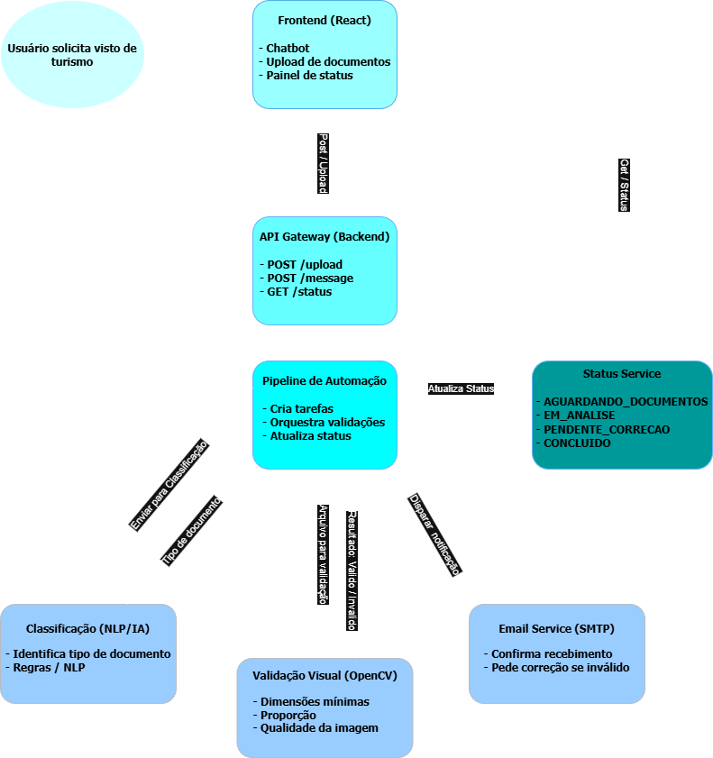

# FIAP - Faculdade de Informática e Administração Paulista

<p align="center">
<a href="https://www.fiap.com.br/"></a>
</p>

<br>

# YOUVISA – Plataforma Inteligente de Atendimento Multicanal (Sprint2)
## Beginner Coders
## 👨‍🎓 Integrantes:
- <a href="https://www.linkedin.com/in/luana-porto-pereira-gomes/">Luana Porto Pereira Gomes</a>
- <a href="https://www.linkedin.com/in/luma-x">Luma Oliveira</a>
- <a href="https://www.linkedin.com/in/priscilla-oliveira-023007333/">Priscilla Oliveira </a>
- <a href="https://www.linkedin.com/in/paulobernardesqs?utm_source=share&utm_campaign=share_via&utm_content=profile&utm_medium=ios_app">Paulo Bernardes</a>

## 👩‍🏫 Professores:
### Tutor(a)
- <a href="https://www.linkedin.com/in/leonardoorabona/">Leonardo Ruiz</a>
### Coordenador(a)
- <a href="https://www.linkedin.com/in/profandregodoi/">André Godoi</a>

---

## 📘 Introdução

Este repositório reúne o protótipo funcional desenvolvido para a Sprint 2 do Enterprise Challenge – YOUVISA, cuja proposta é criar um sistema de análise inicial de documentos para solicitação de visto de turismo.

O projeto foi pensado como um MVP realista, simulando o comportamento de sistemas modernos que usam:
- NLP (Processamento de Linguagem Natural)
- IA Generativa (simulada)
- Pipeline inteligente de decisão
- RPA / Agente virtual
- Validação automática de documentos
- Chatbot orientado ao contexto do usuário

Mesmo sem utilizar modelos generativos reais (como GPT, Claude, Gemini ou LLaMA), implementamos fielmente os conceitos ensinados pela FIAP, como:
- interpretação de intenção,
- aprendizado em contexto,
- raciocínio baseado no estado atual,
- respostas dinâmicas,
- pipeline de processamento,
- simulação de agente de e-mail,
- simulação de generative prompting.

---

## 🎯 Objetivo do Projeto

Criar um sistema funcional e demonstrável que permita:

- o envio de documentos obrigatórios (passaporte, residência, financeiro e formulário);
- validação automática do formato e classificação inteligente;
- exibição do status do processo em tempo real;
- simulação de envio de e-mail após uploads;
- chatbot inteligente com comportamento semelhante a IA Generativa;
- interface moderna, simples e orientada ao usuário;
- fluxo de decisão inspirado em pipelines reais de IA e RPA.

## 📌 Escopo do Protótipo

### Fluxo principal simulado:
- Upload de arquivos JPEG/PNG, com bloqueio de PDF;
- Classificação automática baseada em NLP simbólico;
- Identificação dos documentos faltantes;
- Tratamento automático de pendências (arquivo inválido ou errado);
- Simulação de IA Generativa para respostas do chatbot YOUVISA;
- Chatbot com raciocínio contextual, baseado no status do processo;
- Pipeline inspirado em arquiteturas de agentes LLM;
- Simulação de RPA para envio automático de e-mails;
- UI refinada com comportamento dinâmico e respostas condicionadas.

---

## 🧩 Simulações Inteligentes (NLP, IA Generativa, RPA)

### NLP (Processamento de Linguagem Natural)
O projeto utiliza NLP simbólico, totalmente integrado ao backend e ao chatbot, para:
- interpretar mensagens como:
“qual documento falta?”,
“posso enviar PDF?”,
“status do processo?”,
“enviei o documento”.
- classificar documentos pelo nome do arquivo usando dicionário semântico.

O classificador identifica automaticamente:
- Passaporte
- Comprovante de residência
- Comprovante financeiro
- Formulário YOUVISA

---

### 🤖 IA Generativa (Simulada)
Embora não utilize modelos de linguagem reais (como OpenAI ou Gemini), o chatbot YOUVISA implementa comportamento generativo simulado, baseado nos conceitos ensinados pela FIAP:
- respostas adaptadas ao contexto do processo
- raciocínio condicional baseado no status_global
- mensagens personalizadas
- explicações estruturadas
- interação humanizada
- respostas dinâmicas, não fixas
Exemplo:
Se faltar somente o comprovante financeiro, o chatbot responde especificamente sobre esse documento.
Se tudo estiver correto, ele celebra com o usuário.

---

### 🟦 RPA (Automação Robótica de Processos – Simulada)
Implementamos um agente automático que:
- recebe o documento
- valida formato
- classifica
- identifica erros
- atualiza status
- dispara um e-mail automático (simulado via console))
Essa função imita o comportamento de um robô corporativo, como os vistos em pipelines de RPA.

---

## 🏗 Arquitetura Geral da Solução

Usuário
   ↓
Frontend (React + TypeScript)
   ↓ API REST
Backend (FastAPI – Python)
   ↓
Pipeline Inteligente
   • Validação de Imagem
   • NLP simbólico
   • Classificação
   • Decisão do status
   • Simulação de e-mail (RPA)
   ↓
Status atualizado em tempo real

<p align="center">
  
</p>

---

## 📂 Estrutura das Pastas

```
DESAFIO-YOUVISA-SPRINT2/
│── assets/
│   ├── diagramas/
│   ├── prints/
│   └── logo-fiap.png
│
│── backend/
│   ├── venv/
│   ├── src/
│   │   ├── api/
│   │   │   └── router.py
│   │   ├── email_service/
│   │   │   └── sender.py
│   │   ├── models/
│   │   │   ├── document.py
│   │   │   └── models.py
│   │   ├── nlp/
│   │   │   └── classifier.py
│   │   ├── pipeline/
│   │   │   ├── pipeline.py
│   │   │   ├── processor.py
│   │   │   └── repository.py
│   │   ├── vision/
│   │   │   └── validator.py
│   │   └── main.py
│   │   ├── uploads/
│   ├── requirements.txt
│   
│── frontend/
│   └── src/
│   │   ├── assets/
│   |   ├── components/
|   |   |   ├── chatbot.tsx
│   │   │   ├── statuspanel.tsx
│   │   │   └── uploadarea.tsx
│   |   ├── services/
│   |   |   └── api.ts
│── docs/
│   ├── sprint2/
|   |   ├── relatório-técnico
│   |   └── escopo-fluxo-principal-youvisa-sprint2.md
│
└── README.md

```
---

## ⚙️ Tecnologias Utilizadas
### Backend
- Python
- FastAPI
- Pydantic
- Uvicorn
- NLP simbólico
- Pipeline customizado
- Simulação de e-mail (agente RPA)

### Frontend
- React
- TypeScript
- Vite
- UI customizada e responsiva

---

## 🚀 Como Executar o Projeto

### Backend
1. cd backend/src
2. uvicorn main:app --reload --host 0.0.0.0 --port 8000

Documentação da API:
👉 http://localhost:8000/docs


### Frontend
1. cd frontend
2. npm install
3. npm run dev

Acesse em:
👉 http://localhost:5173/

---

### 📤 Regras de Envio de Documentos

Formatos aceitos:
- JPEG
- PNG
Formatos rejeitados:
- PDF
- Qualquer outro formato inválido
Ao enviar algo inválido:
- Documento vira pendente
- Usuário recebe e-mail simulado
- Chatbot explica o motivo da rejeição

---

### 🗂️ Classificação Automática de Documentos

O backend interpreta o nome do arquivo:

| Palavra no nome                  | Classificação |
| -------------------------------- | ------------- |
| "passaporte"                     | PASSAPORTE    |
| "endereco", "residencia"         | RESIDÊNCIA    |
| "financeiro", "extrato", "banco" | FINANCEIRO    |
| "formulario"                     | FORMULÁRIO    |
| Outra                            | DESCONHECIDO  |

---

🤖 Chatbot YOUVISA (NLP + IA Generativa Simulada)

O chatbot consegue:
- interpretar mensagens naturais
- entender intenções
- responder dinamicamente
- analisar o status atual
- guiar o usuário em cada etapa
- explicar pendências
- identificar documentos faltantes
- recusar PDFs
- simular comportamento generativo

Exemplos de intenções entendidas:
“qual documento falta?”
“quais documentos preciso enviar?”
“posso enviar pdf?”
“enviei o documento”
“status do processo?”

---

### 📧 Simulação de E-mail (Agente RPA)
Sempre que um documento é enviado:
1. O pipeline processa
2. A validação ocorre
3. O tipo é classificado
4. O status é atualizado
5. O sistema "envia" um e-mail (no console)

Exemplos:
✔ “Documento validado com sucesso”
❌ “Arquivo inválido, envie JPEG/PNG”
🟠 “Documento não corresponde ao tipo esperado”

---

🧪 ### Testes Realizados

### Testes funcionais:
- upload de JPEG
- upload de PDF (erro simulado)
- envio parcial de documentos
- envio completo
- fluxo com pendências
- fluxo com documentos faltantes
- chatbot interpretando variadas intenções

### Testes de UX:
- feedback visual
- mensagens dinâmicas
- rolagem automática no chat
- exibição clara do status_global

### 🎨 UI/UX - Design e Experiência

Camada foi refinada com:
- Layout minimalista
- cores suaves
- fonte de fácil leitura
- chatbot elegante e responsivo
- mensagens claras e amigaveis
- foco no fluxo do usuário

### 🏁 Conclusão

Este protótipo demonstra, de forma clara e funcional, como um sistema real de análise documental pode operar combinando:
- NLP simbólico
- Simulação de IA Generativa
- Simulação de RPA
- Pipeline inteligente
- Chatbot contextual
- UX bem estruturada
Nessa Sprint, cumprimos com os requisitos, entregando um produto coerente, funcional e alinhado às práticas ensinadas pela FIAP.

## 📄 Documentação da Sprint 2

- **Escopo do Fluxo Principal:**  
  [`docs/sprint2/escopo-fluxo-principal-youvisa-sprint2.md`](docs/sprint2/escopo-fluxo-principal-youvisa-sprint2.md)

- **Arquitetura do Pipeline (fluxograma):**  
  [`docs/sprint2/arquitetura-pipeline-youvisa.png`](docs/sprint2/arquitetura-pipeline-youvisa.png)

- **Relatório Técnico:**  
  [`docs/sprint2/relatorio-tecnico-sprint2.md`](docs/sprint2/relatorio-tecnico-sprint2.pdf)


